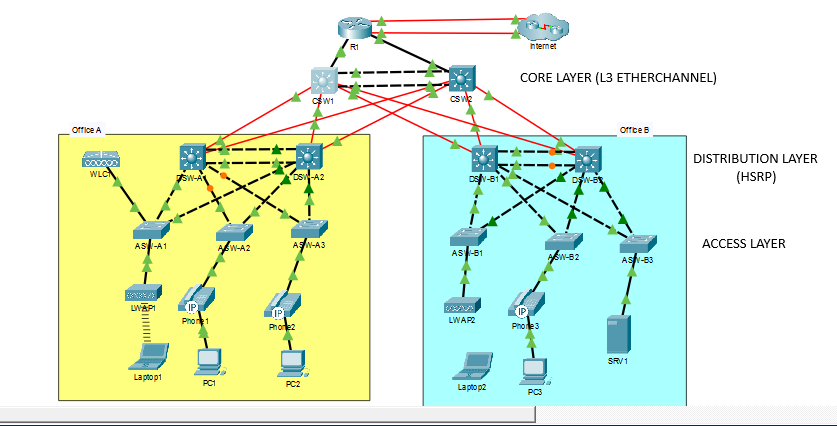

# 🌐 Cisco CCNA Mega Lab – Full Enterprise Network Topology

> A complete, multi-part enterprise network lab built in Cisco Packet Tracer, covering every major CCNA topic in a single unified topology.

---

## 📋 Table of Contents

- [Overview](#overview)
- [Network Topology](#network-topology)
- [Lab Parts](#lab-parts)
- [IP Addressing Scheme](#ip-addressing-scheme)
  - [WAN Links (R1)](#wan-links-r1)
  - [R1 → Core Switch Links](#r1--core-switch-links-30)
  - [CSW1 ↔ CSW2 EtherChannel](#csw1--csw2-etherchannel-30)
  - [CSW1 → Distribution Switches](#csw1--distribution-switches-30)
  - [CSW2 → Distribution Switches](#csw2--distribution-switches-30)
  - [SVI / HSRP Gateway Addresses](#svi--hsrp-gateway-addresses)
  - [Access Switch Management IPs](#access-switch-management-ips-vlan-99)
  - [Loopback Addresses](#loopback-addresses-ospf-router-ids)
  - [End Devices](#end-device-addresses)
- [VLAN Design](#vlan-design)
- [HSRP Summary](#hsrp-summary)
- [Technologies Used](#technologies-used)
- [Credits](#credits)

---

## Overview

This lab simulates a full enterprise network with two offices (Office A and Office B), a core layer, distribution layer, access layer, WAN connectivity, and a wireless infrastructure. It was built following [Jeremy's IT Lab](https://www.youtube.com/@JeremysITLab) CCNA Mega Lab series.

**Devices in topology:**

| Role | Devices |
|---|---|
| Router | R1 |
| Core Switches | CSW1, CSW2 |
| Distribution Switches (Office A) | DSW-A1, DSW-A2 |
| Distribution Switches (Office B) | DSW-B1, DSW-B2 |
| Access Switches (Office A) | ASW-A1, ASW-A2, ASW-A3 |
| Access Switches (Office B) | ASW-B1, ASW-B2, ASW-B3 |
| Wireless LAN Controller | WLC1 |
| Server | SRV1 |

---

## Network Topology



---

## Lab Parts

### Part 1 – Initial Setup
- Hostnames configured on all devices
- Enable secret: `jeremysitlab` (type 9 / scrypt hashing where supported, type 5 fallback)
- Local user account: `cisco` / `ccna` (type 9 hashing)
- Console line: local login, 30-minute inactivity timeout, synchronous logging

```ios
hostname <device-name>
!
enable algorithm-type scrypt secret jeremysitlab
!
username cisco algorithm-type scrypt secret ccna
!
line console 0
 login local
 exec-timeout 30 0
 logging synchronous
```

---

### Part 2 – VLANs & Layer-2 EtherChannel

| Office | EtherChannel | Protocol | Mode |
|---|---|---|---|
| Office A | DSW-A1 ↔ DSW-A2 Po1 | PAgP (Cisco) | Desirable |
| Office B | DSW-B1 ↔ DSW-B2 Po1 | LACP (IEEE) | Active |

**Trunk configuration on all Distribution–Access links:**
- Explicitly disable DTP (`switchport nonegotiate`)
- Native VLAN: `1000` (unused)
- VTP domain: `JeremysITLab`, version 2

**Office A VLANs:**

| VLAN | Name |
|---|---|
| 10 | PCs |
| 20 | Phones |
| 40 | Wi-Fi |
| 99 | Management |

**Office B VLANs:**

| VLAN | Name |
|---|---|
| 10 | PCs |
| 20 | Phones |
| 30 | Servers |
| 99 | Management |

**ASW-A1 special trunk (WLC1 uplink):**
- Allows VLANs 40, 99
- Management VLAN 99 untagged (native)

---

### Part 3 – IP Addresses, Layer-3 EtherChannel & HSRP

- `ip routing` enabled on all Core and Distribution switches
- Layer-3 EtherChannel between CSW1 and CSW2 using **PAgP (desirable)**
- HSRPv2 configured on all Distribution switch SVIs
- See full [IP Addressing Scheme](#ip-addressing-scheme) below

---

### Part 4 – Rapid Spanning Tree Protocol

- **Rapid PVST+** on all Access and Distribution switches
- STP root bridge aligned with HSRP Active router per VLAN
- STP priorities set to lowest (0) for Active, one increment higher (4096) for Standby
- **PortFast + BPDU Guard** on all end-host-facing ports (configured in interface mode)

**Office A STP priority alignment:**

| VLAN | STP Root (priority 0) | STP Secondary (priority 4096) |
|---|---|---|
| 10, 99 | DSW-A1 | DSW-A2 |
| 20, 40 | DSW-A2 | DSW-A1 |

**Office B STP priority alignment:**

| VLAN | STP Root (priority 0) | STP Secondary (priority 4096) |
|---|---|---|
| 10, 99 | DSW-B1 | DSW-B2 |
| 20, 30 | DSW-B2 | DSW-B1 |

---

### Part 5 – Static & Dynamic Routing

**OSPF (Process 1, Area 0):**
- All routers and L3 switches participate
- Router IDs manually set to match Loopback0 IP
- All physical L3 links set to `ip ospf network point-to-point` (no DR/BDR election)
- Loopback interfaces: passive
- Distribution SVIs (except Management): passive
- R1 configured as **ASBR** with `default-information originate`

**Static default routes on R1:**

```ios
ip route 0.0.0.0 0.0.0.0 GigabitEthernet0/0/0        ! Primary (AD 1)
ip route 0.0.0.0 0.0.0.0 GigabitEthernet0/1/0 2      ! Floating (AD 2)
```

---

### Part 6 – Network Services

| Service | Detail |
|---|---|
| **DHCP** | R1 serves all subnets; first 10 usable IPs excluded per pool |
| **DHCP Relay** | All Distribution SVIs relay to R1 Loopback0 (`10.0.0.76`) |
| **DNS** | SRV1 (`10.5.0.4`); domain `jeremysitlab.com` on all devices |
| **NTP** | R1 = stratum 5 master; all switches sync to R1 Loopback0 with key auth (key 1, `ccna`) |
| **SNMP** | Community `SNMPSTRING` read-only (GET only, no SET) |
| **Syslog** | All devices log to SRV1 at all severity levels; buffer = 8192 bytes |
| **FTP** | R1 downloads new IOS from SRV1; credentials `cisco`/`cisco` |
| **SSH** | RSA 4096-bit, SSHv2 only; ACL 1 restricts VTY to Office A PCs subnet |
| **CDP/LLDP** | CDP disabled globally; LLDP enabled; LLDP Tx disabled on F0/1 of all Access switches |

**DHCP pools on R1:**

| Pool | Subnet | Gateway | WLC Option |
|---|---|---|---|
| A-Mgmt | 10.0.0.0/28 | 10.0.0.1 | 10.0.0.7 |
| A-PC | 10.1.0.0/24 | 10.1.0.1 | — |
| A-Phone | 10.2.0.0/24 | 10.2.0.1 | — |
| B-Mgmt | 10.0.0.16/28 | 10.0.0.17 | 10.0.0.7 |
| B-PC | 10.3.0.0/24 | 10.3.0.1 | — |
| B-Phone | 10.4.0.0/24 | 10.4.0.1 | — |
| Wi-Fi | 10.6.0.0/24 | 10.6.0.1 | — |

**NAT on R1:**
- Static NAT: SRV1 (`10.5.0.4`) → `203.0.113.113`
- Dynamic PAT pool `POOL1`: `203.0.113.200` – `203.0.113.207` (/29)
- ACL 2 matches: Office A PCs, Office A Phones, Office B PCs, Office B Phones, Wi-Fi

---

### Part 7 – Security: ACLs & Layer-2 Security

**Extended ACL `OfficeA_to_OfficeB`** (applied closest to source – Office A Distribution):
- Permit ICMP from `10.1.0.0/24` to `10.3.0.0/24`
- Deny all other traffic from `10.1.0.0/24` to `10.3.0.0/24`
- Permit all other traffic

**Port Security (all Access switch F0/1 ports):**
- Minimum MAC addresses allowed (1 per port, except SRV1)
- Violation mode: `restrict` (blocks invalid, sends notification, valid traffic continues)
- `switchport port-security mac-address sticky`

**DHCP Snooping (all Access switches):**
- Enabled for all active VLANs
- Uplink ports trusted; access ports untrusted
- Option 82 insertion disabled
- Rate limit: 15 pps on untrusted ports; 100 pps on ASW-A1's WLC1 port

**Dynamic ARP Inspection (all Access switches):**
- Enabled for all active VLANs
- Uplink ports trusted
- All optional validation checks enabled (`ip arp inspection validate src-mac dst-mac ip`)

---

### Part 8 – IPv6

- IPv6 routing enabled on R1, CSW1, CSW2
- EUI-64 used on R1 G0/0 ↔ CSW1 G1/0/1 (prefix `2001:db8:a1::/64`)
- EUI-64 used on R1 G0/1 ↔ CSW2 G1/0/1 (prefix `2001:db8:a2::/64`)
- CSW1/CSW2 Po1: IPv6 enabled without static address (`ipv6 enable`)
- Two default static routes on R1:
  - Recursive via `2001:db8:a::1`
  - Floating fully-specified via `2001:db8:b::1` (AD+1)

---

### Part 9 – Wireless

- WLC1 accessed via `https://10.0.0.7` (admin / adminPW12)
- Dynamic interface: **Wi-Fi**, VLAN 40, IP `10.6.0.4`, GW `10.6.0.1`, DHCP `10.0.0.76`
- WLAN: Profile `Wi-Fi`, SSID `Wi-Fi`, ID 1, WPA2/AES, PSK `cisco123`
- Both LWAPs (LWAP1, LWAP2) associated with WLC1

---

## IP Addressing Scheme

### WAN Links (R1)

| Interface | IP | Note |
|---|---|---|
| G0/0/0 | DHCP | Primary ISP |
| G0/1/0 | DHCP | Secondary ISP (floating) |

---

### R1 → Core Switch Links (/30)

| Link | R1 Interface | R1 IP | Device | Device Interface | Device IP | Subnet |
|---|---|---|---|---|---|---|
| R1 → CSW1 | G0/0 | 10.0.0.33 | CSW1 | G1/0/1 | 10.0.0.34 | 10.0.0.32/30 |
| R1 → CSW2 | G0/1 | 10.0.0.37 | CSW2 | G1/0/1 | 10.0.0.38 | 10.0.0.36/30 |

---

### CSW1 ↔ CSW2 EtherChannel (/30)

| Link | Device | Interface | IP | Subnet |
|---|---|---|---|---|
| L3 Po1 | CSW1 | Port-channel1 | 10.0.0.41 | 10.0.0.40/30 |
| L3 Po1 | CSW2 | Port-channel1 | 10.0.0.42 | 10.0.0.40/30 |

---

### CSW1 → Distribution Switches (/30)

| CSW1 Interface | CSW1 IP | Downstream Device | Device Interface | Device IP | Subnet |
|---|---|---|---|---|---|
| G1/1/1 | 10.0.0.45 | DSW-A1 | G1/1/1 | 10.0.0.46 | 10.0.0.44/30 |
| G1/1/2 | 10.0.0.49 | DSW-A2 | G1/1/1 | 10.0.0.50 | 10.0.0.48/30 |
| G1/1/3 | 10.0.0.53 | DSW-B1 | G1/1/1 | 10.0.0.54 | 10.0.0.52/30 |
| G1/1/4 | 10.0.0.57 | DSW-B2 | G1/1/1 | 10.0.0.58 | 10.0.0.56/30 |

---

### CSW2 → Distribution Switches (/30)

| CSW2 Interface | CSW2 IP | Downstream Device | Device Interface | Device IP | Subnet |
|---|---|---|---|---|---|
| G1/1/1 | 10.0.0.61 | DSW-A1 | G1/1/2 | 10.0.0.62 | 10.0.0.60/30 |
| G1/1/2 | 10.0.0.65 | DSW-A2 | G1/1/2 | 10.0.0.66 | 10.0.0.64/30 |
| G1/1/3 | 10.0.0.69 | DSW-B1 | G1/1/2 | 10.0.0.70 | 10.0.0.68/30 |
| G1/1/4 | 10.0.0.73 | DSW-B2 | G1/1/2 | 10.0.0.74 | 10.0.0.72/30 |

---

### SVI / HSRP Gateway Addresses

#### Office A

| Device | VLAN | SVI IP | Subnet | HSRP VIP | HSRP Role | Priority |
|---|---|---|---|---|---|---|
| DSW-A1 | 99 (Mgmt) | 10.0.0.2 | /28 | 10.0.0.1 | **Active** | 110 |
| DSW-A2 | 99 (Mgmt) | 10.0.0.3 | /28 | 10.0.0.1 | Standby | 100 |
| DSW-A1 | 10 (PCs) | 10.1.0.2 | /24 | 10.1.0.1 | **Active** | 110 |
| DSW-A2 | 10 (PCs) | 10.1.0.3 | /24 | 10.1.0.1 | Standby | 100 |
| DSW-A1 | 20 (Phones) | 10.2.0.2 | /24 | 10.2.0.1 | Standby | 100 |
| DSW-A2 | 20 (Phones) | 10.2.0.3 | /24 | 10.2.0.1 | **Active** | 110 |
| DSW-A1 | 40 (Wi-Fi) | 10.6.0.2 | /24 | 10.6.0.1 | Standby | 100 |
| DSW-A2 | 40 (Wi-Fi) | 10.6.0.3 | /24 | 10.6.0.1 | **Active** | 110 |

#### Office B

| Device | VLAN | SVI IP | Subnet | HSRP VIP | HSRP Role | Priority |
|---|---|---|---|---|---|---|
| DSW-B1 | 99 (Mgmt) | 10.0.0.18 | /28 | 10.0.0.17 | **Active** | 110 |
| DSW-B2 | 99 (Mgmt) | 10.0.0.19 | /28 | 10.0.0.17 | Standby | 100 |
| DSW-B1 | 10 (PCs) | 10.3.0.2 | /24 | 10.3.0.1 | **Active** | 110 |
| DSW-B2 | 10 (PCs) | 10.3.0.3 | /24 | 10.3.0.1 | Standby | 100 |
| DSW-B1 | 20 (Phones) | 10.4.0.2 | /24 | 10.4.0.1 | Standby | 100 |
| DSW-B2 | 20 (Phones) | 10.4.0.3 | /24 | 10.4.0.1 | **Active** | 110 |
| DSW-B1 | 30 (Servers) | 10.5.0.2 | /24 | 10.5.0.1 | Standby | 100 |
| DSW-B2 | 30 (Servers) | 10.5.0.3 | /24 | 10.5.0.1 | **Active** | 110 |

---

### Access Switch Management IPs (VLAN 99)

| Device | VLAN 99 IP | Subnet | Default Gateway |
|---|---|---|---|
| ASW-A1 | 10.0.0.4 | /28 | 10.0.0.1 (HSRP VIP) |
| ASW-A2 | 10.0.0.5 | /28 | 10.0.0.1 (HSRP VIP) |
| ASW-A3 | 10.0.0.6 | /28 | 10.0.0.1 (HSRP VIP) |
| ASW-B1 | 10.0.0.20 | /28 | 10.0.0.17 (HSRP VIP) |
| ASW-B2 | 10.0.0.21 | /28 | 10.0.0.17 (HSRP VIP) |
| ASW-B3 | 10.0.0.22 | /28 | 10.0.0.17 (HSRP VIP) |

---

### Loopback Addresses (OSPF Router IDs)

| Device | Loopback0 IP | Role |
|---|---|---|
| R1 | 10.0.0.76/32 | OSPF RID · NTP master source · DHCP relay target |
| CSW1 | 10.0.0.77/32 | OSPF RID |
| CSW2 | 10.0.0.78/32 | OSPF RID |
| DSW-A1 | 10.0.0.79/32 | OSPF RID |
| DSW-A2 | 10.0.0.80/32 | OSPF RID |
| DSW-B1 | 10.0.0.81/32 | OSPF RID |
| DSW-B2 | 10.0.0.82/32 | OSPF RID |

---

### End Device Addresses

| Device | IP | Subnet | Gateway |
|---|---|---|---|
| SRV1 | 10.5.0.4/24 | 10.5.0.0/24 | 10.5.0.1 (HSRP VIP) |
| WLC1 dynamic interface | 10.6.0.4/24 | 10.6.0.0/24 | 10.6.0.1 (HSRP VIP) |
| SRV1 NAT (static) | 203.0.113.113 | — | Internet |
| PAT pool POOL1 | 203.0.113.200–.207 | /29 | Internet |

---

## VLAN Design

| VLAN | Name | Office | Subnet | HSRP VIP |
|---|---|---|---|---|
| 10 | PCs | A | 10.1.0.0/24 | 10.1.0.1 |
| 20 | Phones | A | 10.2.0.0/24 | 10.2.0.1 |
| 40 | Wi-Fi | A | 10.6.0.0/24 | 10.6.0.1 |
| 99 | Management | A | 10.0.0.0/28 | 10.0.0.1 |
| 10 | PCs | B | 10.3.0.0/24 | 10.3.0.1 |
| 20 | Phones | B | 10.4.0.0/24 | 10.4.0.1 |
| 30 | Servers | B | 10.5.0.0/24 | 10.5.0.1 |
| 99 | Management | B | 10.0.0.16/28 | 10.0.0.17 |
| 1000 | Native (unused) | Both | — | — |

---

## HSRP Summary

HSRPv2 is used on all Distribution switch SVIs. Active/Standby roles are intentionally split across DSW-A1 and DSW-A2 (and DSW-B1/B2) per VLAN to load-balance traffic across uplinks. Preemption is enabled on the Active router in every group.

| Group | VLAN | Active Router | Standby Router | VIP |
|---|---|---|---|---|
| 1 | 99 (Office A Mgmt) | DSW-A1 | DSW-A2 | 10.0.0.1 |
| 2 | 10 (Office A PCs) | DSW-A1 | DSW-A2 | 10.1.0.1 |
| 3 | 20 (Office A Phones) | DSW-A2 | DSW-A1 | 10.2.0.1 |
| 4 | 40 (Office A Wi-Fi) | DSW-A2 | DSW-A1 | 10.6.0.1 |
| 1 | 99 (Office B Mgmt) | DSW-B1 | DSW-B2 | 10.0.0.17 |
| 2 | 10 (Office B PCs) | DSW-B1 | DSW-B2 | 10.3.0.1 |
| 3 | 20 (Office B Phones) | DSW-B2 | DSW-B1 | 10.4.0.1 |
| 4 | 30 (Office B Servers) | DSW-B2 | DSW-B1 | 10.5.0.1 |

---

## Technologies Used

| Category | Technology |
|---|---|
| Routing | OSPFv2 (Area 0), Static routes, Floating static routes |
| Switching | VLANs, VTP v2, 802.1Q trunking, Rapid PVST+ |
| EtherChannel | PAgP (Cisco), LACP (IEEE 802.3ad), Layer-3 EtherChannel |
| First Hop Redundancy | HSRPv2 |
| IP Services | DHCP, DNS, NTP (authenticated), SNMP, Syslog, FTP, NAT/PAT |
| Security | SSH v2, ACLs (standard & extended), Port Security, DHCP Snooping, DAI |
| IPv6 | Static routes, EUI-64, Floating static routes |
| Wireless | WLC, LWAP (lightweight APs), WPA2/AES WLAN |
| Discovery | LLDP (CDP disabled globally) |

---

## Credits

- Lab design: [Jeremy's IT Lab](https://www.youtube.com/@JeremysITLab) – CCNA Mega Lab series
- Simulator: [Cisco Packet Tracer](https://www.netacad.com/courses/packet-tracer)

---

*Built as part of CCNA exam preparation. All configurations were tested end-to-end in Packet Tracer.*
